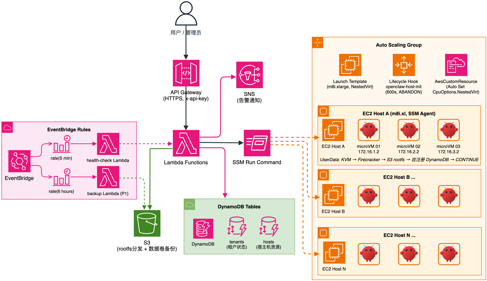

# OpenClaw on EC2 microVM

基于 AWS EC2 嵌套虚拟化，通过 Firecracker microVM 实现 OpenClaw 多租户隔离部署，ASG 自动管理宿主机生命周期。

> 本项目依赖 EC2 [嵌套虚拟化 (Nested Virtualization)](https://docs.aws.amazon.com/AWSEC2/latest/UserGuide/nested-virtualization.html) 功能，在 EC2 实例内运行 KVM + Firecracker microVM。目前仅 Intel 系列 (c8i/m8i/r8i 等) 支持该功能。

## 项目结构

```
openclaw-firecracker/
├── config.yml                # 全局配置 (宿主机规格、VM 参数、S3、ASG)
├── setup.sh                  # 一键部署 + 导出环境变量到 .env.deploy
├── build-rootfs.sh           # rootfs 镜像构建 + S3 上传
├── connect-vm.sh             # 快速登录 microVM: ./connect-vm.sh <tenant-id>
├── deploy/                   # CDK 项目
│   ├── stack.py              # 基础设施定义 (ASG/LT/DynamoDB/Lambda/API GW/S3/IAM)
│   ├── app.py                # CDK 入口
│   ├── lambda/               # Orchestrator 业务逻辑
│   │   ├── api/handler.py    # 租户 CRUD + 宿主机管理 API
│   │   └── health_check/handler.py  # 定时健康检查 + 自动重启
│   └── userdata/             # 宿主机脚本 (synth 时内联到 UserData)
│       ├── init-host.sh      # 宿主机初始化 (KVM/Firecracker/rootfs/自注册)
│       ├── launch-vm.sh      # microVM 启动
│       └── stop-vm.sh        # microVM 停止
└── README.md                 # 用户手册 (本文件)
```

## 部署架构

```
用户/管理员
    │
    ▼
API Gateway (HTTPS, x-api-key)
    │
    ▼
Lambda Functions ──── DynamoDB
    │                 ├── tenants (租户状态)
    │                 └── hosts (宿主机资源)
    │
    ├── SSM Run Command ──→ EC2 Host A (m8i.xl, SSM Agent)
    │                       ├── microVM 01 (172.16.1.2)
    │                       ├── microVM 02 (172.16.2.2)
    │                       └── microVM 03 (172.16.3.2)
    │
    ├── SSM Run Command ──→ EC2 Host B ...
    │
    ├── S3 (rootfs 分发 + 数据卷备份)
    │
    └── SNS (告警通知)

ASG: 宿主机自动扩缩管理 (参数见 config.yml)
EventBridge: 健康检查 (5min) + 数据备份 (6hr)
```
<details>
<summary>系统架构图 (详细)</summary>



</details>

## 前置条件

- AWS 账号 + CLI 配置
- CDK CLI + Python 3.12+
- S3 上已有 rootfs 镜像 (见 Rootfs 管理)
- 宿主机配置通过 `config.yml` 管理 (见下方配置说明)

## 快速开始

```bash
# 1. 部署基础设施 (ASG 会自动启动宿主机并完成初始化)
./setup.sh ap-northeast-1 lab
# 部署完成后环境变量保存在 .env.deploy

# 2. 加载环境变量 + 获取 API Key
source .env.deploy
API_KEY=$(aws apigateway get-api-key --api-key $ApiKeyId \
  --include-value --query value --output text --profile $PROFILE --region $REGION)

# 3. 创建租户 (自动选择有空闲资源的宿主机)
curl -s -X POST "$ApiUrl/tenants" -H "x-api-key: $API_KEY" \
  -d '{"name":"my-agent","vcpu":2,"mem_mb":4096}' | jq .

# 4. SSH 进 microVM 完成 OpenClaw 初始化
sshpass -p openclaw ssh root@<guest_ip>
openclaw onboard

# 5. 停止租户
curl -s -X POST "$ApiUrl/tenants/openclaw-01/stop" -H "x-api-key: $API_KEY"
```

## 配置文件 (config.yml)

项目根目录的 `config.yml` 是所有组件 (CDK stack / Lambda / UserData) 的唯一配置源。

| 分类 | 配置项 | 默认值 | 说明 |
|------|--------|--------|------|
| host | instance_type | m8i.xlarge | 需支持 NestedVirtualization (c8i/m8i/r8i) |
| host | root_volume_gb | 20 | 系统卷 |
| host | data_volume_gb | 100 | 数据卷，挂载到 /data |
| host | reserved_vcpu | 1 | 预留给宿主机 |
| host | reserved_mem_mb | 2048 | 预留给宿主机 |
| asg | min/max/desired | 0 / 5 / 1 | ASG 容量 |
| asg | use_spot | false | Spot 实例 (省 ~60-70%，可能被回收) |
| vm | default_vcpu | 2 | 每个 microVM 的 vCPU |
| vm | default_mem_mb | 4096 | 每个 microVM 的内存 |
| vm | data_disk_mb | 4096 | 每个 microVM 的数据盘 |
| health_check | interval_minutes | 1 | 探活间隔 |
| health_check | max_failures | 3 | 连续失败后自动重启 |

修改后重新部署即可生效：`./setup.sh <region> <profile>`

## 宿主机管理 (ASG)

宿主机由 Auto Scaling Group 全自动管理，无需手动创建 EC2。

```bash
# 查看 ASG 状态
aws autoscaling describe-auto-scaling-groups --auto-scaling-group-names openclaw-hosts-asg \
  --query 'AutoScalingGroups[0].{Desired:DesiredCapacity,Instances:Instances[*].{Id:InstanceId,State:LifecycleState}}' \
  --profile lab --region ap-northeast-1

# 扩容
aws autoscaling set-desired-capacity --auto-scaling-group-name openclaw-hosts-asg \
  --desired-capacity 2 --profile lab --region ap-northeast-1

# 缩容到 0
aws autoscaling set-desired-capacity --auto-scaling-group-name openclaw-hosts-asg \
  --desired-capacity 0 --profile lab --region ap-northeast-1

# 查看实例初始化日志
aws ssm send-command --instance-ids <id> --document-name AWS-RunShellScript \
  --parameters 'commands=["cat /var/log/openclaw-init.log"]' \
  --profile lab --region ap-northeast-1
```

## 多实例部署

```bash
curl -s -X POST "$ApiUrl/tenants" -H "x-api-key: $API_KEY" \
  -d '{"name":"agent-a","vcpu":2,"mem_mb":4096}' | jq .   # → 172.16.1.2
curl -s -X POST "$ApiUrl/tenants" -H "x-api-key: $API_KEY" \
  -d '{"name":"agent-b","vcpu":1,"mem_mb":2048}' | jq .   # → 172.16.2.2
curl -s -X POST "$ApiUrl/tenants" -H "x-api-key: $API_KEY" \
  -d '{"name":"agent-c","vcpu":1,"mem_mb":2048}' | jq .   # → 172.16.3.2
```

## API 认证

所有 API 请求需携带 `x-api-key` header，否则返回 403。

```bash
# 查看当前 key
aws apigateway get-api-key --api-key <key-id> --include-value --query 'value' --output text --profile lab --region ap-northeast-1

# 调用示例
curl -H "x-api-key: <your-key>" https://<api-url>/v1/tenants
```

### API Key 管理

```bash
REGION=ap-northeast-1
PROFILE=lab

# 创建新 key (每个运维人员一个)
aws apigateway create-api-key --name "operator-alice" --enabled \
  --profile $PROFILE --region $REGION

# 关联到 usage plan (从 CDK output 或控制台获取 plan ID)
PLAN_ID=$(aws apigateway get-usage-plans --query "items[?name=='openclaw-plan'].id" --output text --profile $PROFILE --region $REGION)
aws apigateway create-usage-plan-key --usage-plan-id $PLAN_ID \
  --key-id <new-key-id> --key-type API_KEY \
  --profile $PROFILE --region $REGION

# 禁用 key (人员离职)
aws apigateway update-api-key --api-key <key-id> \
  --patch-operations op=replace,path=/enabled,value=false \
  --profile $PROFILE --region $REGION

# 删除 key
aws apigateway delete-api-key --api-key <key-id> \
  --profile $PROFILE --region $REGION

# 列出所有 key
aws apigateway get-api-keys --include-values \
  --query "items[*].{name:name,id:id,enabled:enabled}" \
  --output table --profile $PROFILE --region $REGION
```
